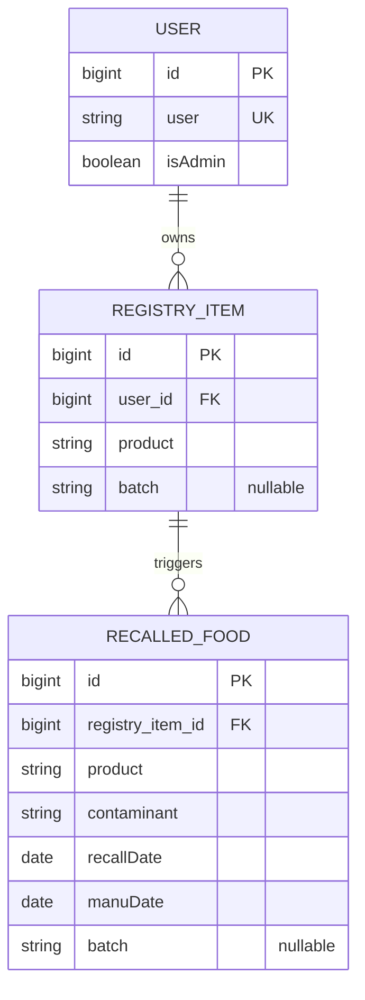

```mermaid
erDiagram
    USER ||--o{ REGISTRY_ITEM : owns
    REGISTRY_ITEM ||--o{ RECALLED_FOOD : triggers
    USER {
        bigint id PK
        string user UK
        boolean isAdmin
    }
    REGISTRY_ITEM {
        bigint id PK
        bigint user_id FK
        string product
        string batch "nullable"
    }
    RECALLED_FOOD {
        bigint id PK
        bigint registry_item_id FK
        string product
        string contaminant
        date recallDate
        date manuDate
        string batch "nullable"
    }
```