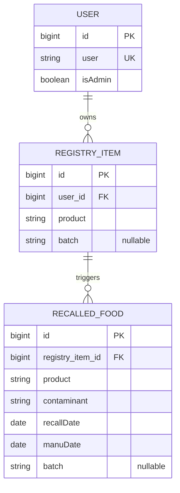

# Brainworm

## 1. If you had the ability to know which food is rotten, would you get it? 
Our API scrapes the FDA database, so that it finds recalls to certain foods. If a user wants to type in a specific word, the API would come out with a recall or not. Who would use it? People who are paranoid, as well as people who want to be safe. If anyone wants to know which foods are recalled, the API and app would notify them. In case, a user buys a lot of this food, the user can get notified on that specific food recall. It could save them from getting sick, or even worse. 

## 2. Resources
| Resource | Key fields | Relationships |
|---|---|---|
| User | id, user, isAdmin | User tracks many RegistryItems |
| RegistryItem | id, product, batch | RegistryItems has many RecalledFood |
| RecalledFood | id, product, contaminant, recallDate, manuDate, batch | RecallFood has one RegistryItem

## 3. ER sketch
Tables, primary and foreign keys, and cardinality. Edit this Mermaid diagram (it renders on GitHub;
try changes at https://mermaid.live):

## 4. Endpoints
| Verb | Path | Auth | Purpose |
|---|---|---|---|
| GET | /api/v1/users/me | user | retrieves current user's password and email |
| GET | /api/v1/registry?page=0&size=20 | user | list monitored foods |
| GET | /api/v1/registry/{itemId} | user | retrieves details for a single monitored food | 
| GET | /api/v1/recalls?sort=recallDate,desc | user | lists active food recalls for user's foods | 
| GET | /api/v1/recalls/{recallId} | user | views details of a specific alert | 
| POST | /api/v1/registry | user | adds a new food item |
| PUT | /api/v1/registry/{itemId} | user | replaces a monitored food's details |
| DELETE | /api/v1/registry/{itemId} | user | removes food item from monitoring | 
| GET | /api/v1/users | admin | lists all users in system |
| GET | /api/v1/users/{userId} | admin | lists a specific user |
| PATCH | /api/v1/users/{userId} | admin | updates a user | 
| DELETE | /api/v1/users/{userId} | admin | completely deletes a user | 

## 5. Technical choices
- **Database host:** Supabase. It holds actual database hosting, so that the team could develop against the same schema. We won't have to rely on the SQLites. It also relies well with SpringBoot. 
- **OAuth2 provider:** OAuth 2. Specifically Google, as we'll be working with Android Studio. It would be a lot easier to use Google's authentication and security than implementing a different one entirely. 
- **Repo layout:** We'll split the API into two repositories. The API repository will be the backend, to which will store all the API routes, the database, as well as any other backend. The App repository will be utilized for Android Studio. It will cover Kotlin, and everything the frontend has to offer. 

## 6. Risks
1. OAuth2 Integration: Implementing an API as a Resource Server that validates a token, rather than a cookies, may be an issue. We'll ensure that Android Studio would successfully generate tokens rather than cookies. 
2. FDA Data structure: Relying on web scraping may break the backend if the HTML changes. If necessary, we could use mock JSON data if we reach a bottleneck. 

## 7. Team and Sprint 1
Project Board -> https://github.com/users/Niko-Proud/projects/1
Alexander Trujillo: Setting up Database
Victoria Ha: Setting up Database
Nikolii Proud: 
Hyun Jeong Lim: Landing Pages
Sprint 1 Due Date: October 10