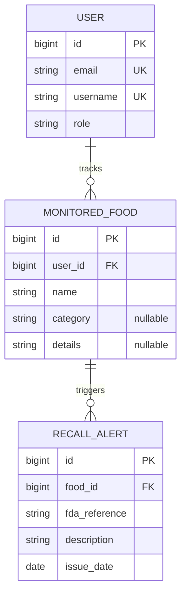

# Brainworm

## 1. If you had the ability to know which food is rotten, would you get it? 
Our API scrapes the FDA database, so that it finds recalls to certain foods. If a user wants to type in a specific word, the API would come out with a recall or not. Who would use it? People who are paranoid, as well as people who want to be safe. If anyone wants to know which foods are recalled, the API and app would notify them. In case, a user buys a lot of this food, the user can get notified on that specific food recall. It could save them from getting sick, or even worse. 

## 2. Resources
| Resource | Key fields | Relationships |
|---|---|---|
| User | id, email, password, username, role | User tracks many monitoredFood |
| MonitoredFood | id, name, category, details | MonitoredFood has many RecallAlerts |
| RecallAlert | id, fda_reference, description, issue_date | RecallAlert has one MonitoredFood

## 3. ER sketch
Tables, primary and foreign keys, and cardinality. Edit this Mermaid diagram (it renders on GitHub;
try changes at https://mermaid.live):

## 4. Endpoints
| Verb | Path | Auth | Purpose |
|---|---|---|---|
| GET | /api/v1/users/me | user | retrieves current user's password and email |
| GET | /api/v1/foods?page=0&size=20 | user | list monitored foods |
| GET | /api/v1/foods/{foodId} | user | retrieves details for a single monitored food | 
| GET | /api/v1/alerts?sort=issue_date,desc | user | lists active food recalls for user's foods | 
| GET | /api/v1/alerts/{alertId} | user | views details of a specific alert | 
| POST | /api/v1/foods | user | adds a new food item |
| PUT | /api/v1/foods/{foodId} | user | replaces a monitored food's details |
| DELETE | /api/v1/foods/{foodId} | user | removes food item from monitoring | 
| GET | /api/v1/users | admin | lists all users in system |
| GET | /api/v1/users/{userId} | admin | lists a specific user |
| PATCH | /api/v1/users/{userId} | admin | updates a user | 
| DELETE | /api/v1/users/{userId} | admin | completely deletes a user | 

## 5. Technical choices
- **Database host:** Supabase. It's really reliable for group projects, and it goes well with Spring Data JPA. 
- **OAuth2 provider:** 
- **Repo layout:** monorepo or split, and why
These become your ADRs later.

## 6. Risks
The two things most likely to go wrong, and what you will do first to find out.

## 7. Team and Sprint 1
Who owns what in Sprint 1. Link your Project board and Sprint 1 milestone.
